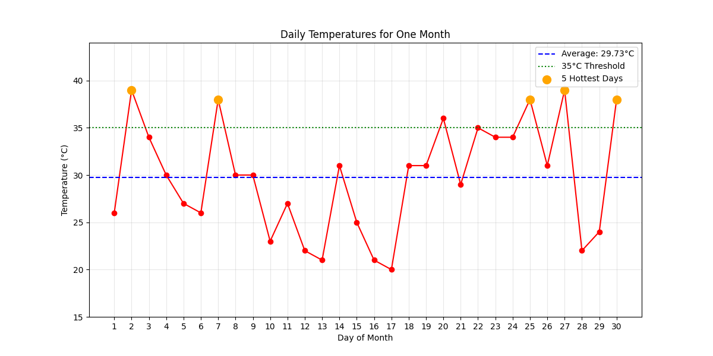

# Temperature-Analysis-Project
A simple data analysis project that generates random temperature data for a month and performs various statistical operations and visualizations.

# 📊 Daily Temperature Analysis (Python Mini Project)

This is a simple Python mini-project that generates, analyzes, and visualizes random daily temperature data over a 30-day period. It demonstrates basic data analysis and plotting using NumPy and Matplotlib — great for beginners learning data science or Python programming!

## 📁 Project Contents

- `temperature_analysis.ipynb`: Main Jupyter Notebook containing all the analysis and plots.
- `Temp.png`: The generated temperature plot showing daily values, average temperature, and the hottest days.
- `README.md`: This file.

## 🧠 What This Project Does

1. **Generates** random temperature data for 30 days (between 20°C and 40°C).
2. **Calculates**:
   - Average temperature
   - The 5 hottest days and their indices
   - The number of days above 35°C
   - The overall temperature range
3. **Visualizes** the data using Matplotlib, highlighting:
   - All daily temperatures
   - Average temperature (as a horizontal line)
   - A 35°C threshold
   - The 5 hottest days

## 🔧 Tools & Libraries Used

- Python 3.x
- [NumPy](https://numpy.org/)
- [Matplotlib](https://matplotlib.org/)
- Jupyter Notebook

## 🖼 Sample Output



## 🚀 How to Run

1. Clone the repository:

   ```bash
   git clone https://github.com/ayush-singh42/Temperature-Analysis-Project
   cd temperature-analysis
